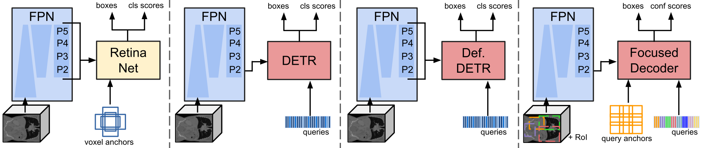
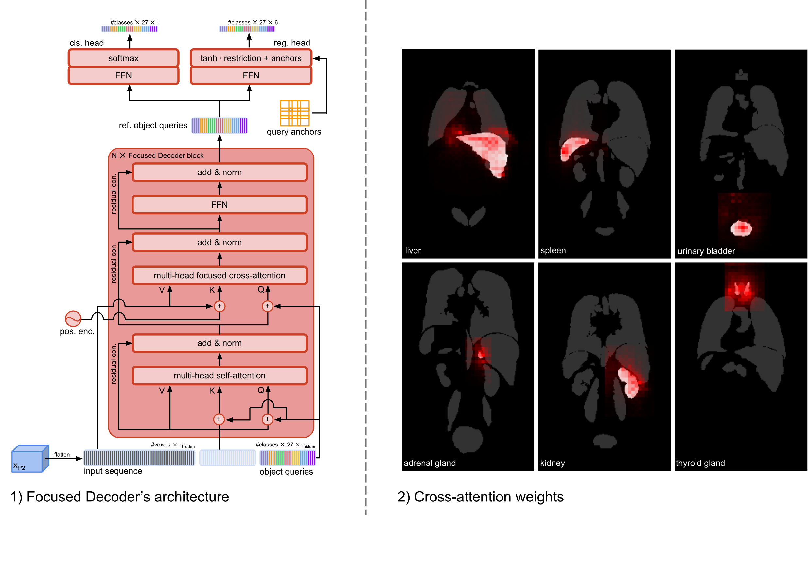

# TransOAR - A 3D medical Detection Transformer library 

The TransOAR project was initially developed for Transformer-based organs-at-risk detection and contains code of three 3D Detection Transformers, namely Focused Decoder, DETR, and Deformable DETR. Additionally, we adopted RetinaNet/Retina U-Net from nnDetection[[3]](#3) into our training pipeline to ensure comparability of results with traditional CNN-based detectors.

To access the featured detectors and their detailed configs please checkout the linked branches:

[Focused Decoder](https://github.com/bwittmann/transoar): A novel medical Detection Transformer restricting cross-attention’s field of view.\
[DETR](https://github.com/bwittmann/transoar/tree/attn-fpn-detr)[[1]](#1): A 3D implementation of the original Detection Transformer DETR.\
[Def DETR](https://github.com/bwittmann/transoar/tree/attn-fpn-def-detr)[[2]](#2): A 3D implementation of Deformable DETR.\
[RetinaNet](https://github.com/bwittmann/transoar/tree/retina-unet)[[3]](#3)[[4]](#4): Adapted from the cited sources to fit our training pipeline.

In the following, we will introduce our main contribution, namely Focused Decoder, and describe the usage of this repository.

## Focused Decoder
\
**TL;DR:** Focused Decoder leverages information from an anatomical region atlas to simultaneously deploy query anchors and restrict the cross-attention’s field of view to regions of interest. Focused Decoder not only delivers competitive results but also facilitates the accessibility of explainable results via attention weights.

### Usage
The usage remains the same for all branches and, therefore, all featured detectors.

#### Installation
Create a new virtual environment and run:
`pip install -e .`

#### Datasets
We provide preprocessing scripts for two datasets.

##### AMOSS22 challenge[[7]](#7):
1) Download the training data of the challenge's [first stage](https://amos22.grand-challenge.org/). The structure should be as follows:
```
AMOS22/
└── imagesTr/
    └── amos_case_id.nii.gz
└── imagesTs/
    └── amos_case_id.nii.gz
└── labelsTr/
    └── amos_case_id.nii.gz
└── task1_dataset.json
└── task2_dataset.json
```
3) Update paths to the raw data in `./config/preprocessing_amos.yaml`.
4) Run `python prepare_dataset_amos.py` to generate the preprocessed dataset, which will be stored under `./datasets`.

##### VISCERAL anatomy benchmark[[6]](#6):
1) Download the CT images contained in the [Gold Corpus](https://visceral.eu/benchmarks/anatomy3-open/) (SC) and [Silver Corpus](https://visceral.eu/news/new-article-page-35/) (GC) subsets. The structure of the SC and GC subsets should be as follows:
```
GC/SC subset/
└── case_id (eg. 10000005_1)/
    └──case_id_CT_wb.nii.gz
    └──case_id_CT_wb_seg.nii.gz
```
2) Crop the images (whole body and thorax and abdomen) to the foreground region presented by the annotated structures.
3) Update paths to SC and GC subsets in `./config/preprocessing_visceral.yaml`.
4) Run `python prepare_dataset_visceral.py` to generate the preprocessed dataset, which will be stored under `./datasets`.

#### Training:
To train on the two datasets run:\
```python CUDA_VISIBLE_DEVICE=<gpu_id> scripts/train.py --config attn_fpn_foc_dec_amos.yaml```
```python CUDA_VISIBLE_DEVICE=<gpu_id> scripts/train.py --config attn_fpn_foc_dec_visceral.yaml```

#### Testing:
To evaluate performances of created checkpoints on the test sets run:\
```python CUDA_VISIBLE_DEVICE=<gpu_id> scripts/test.py --run <name of checkpoint in folder runs> --full_labeled```

For visualization of results and attention maps, please check additional flags in `scripts/test.py`.

## Checkpoints:
coming soon.

## SwinFPN[[5]](#5)
This repository also contains code for SwinFPN. To include 3D Swin Transformer blocks in the FPN backbone, please activate the flag `use_encoder_attn` in the respective config files.\
We additionally experimented with 3D Deformable DETR encoder blocks as additional refinement stages after the FPN backbone. To activate these 3D Deformable DETR encoder blocks set `use_encoder_attn` to `True`.

## References
<a id="1">[1]</a> 
Carion et al., "End-to-end object detection with transformers", EVVC, 2020, https://github.com/facebookresearch/detr.

<a id="2">[2]</a> 
Zhu et al., "Deformable DETR: Deformable transformers for end-to-end object detection", ICLR, 2021, https://github.com/fundamentalvision/Deformable-DETR.

<a id="3">[3]</a> 
Baumgartner et al., "nnDetection: A self-configuring method for medical object detection", MICCAI, 2021, https://github.com/MIC-DKFZ/nnDetection.

<a id="4">[4]</a> 
Jaeger, et al., "Retina U-Net: Embarrassingly simple exploitation of segmentation supervision for medical object detection", PMLR ML4H, 2020, https://github.com/MIC-DKFZ/medicaldetectiontoolkit.

<a id="5">[5]</a> 
Wittmann, et al., "SwinFPN: Leveraging Vision Transformers for 3D Organs-At-Risk Detection", MIDL, 2022.

<a id="6">[6]</a> 
Jimenez-del Toro, et al., "Cloud-based evaluation of anatomical structure segmentation and landmark detection algorithms: VISCERAL anatomy benchmarks", IEEE TMI, 2016, https://visceral.eu/benchmarks.

<a id="7">[7]</a> 
AMOS 2022: Multi-Modality Abdominal Multi-Organ Segmentation Challenge 2022, MICCAI, 2022, https://amos22.grand-challenge.org/.


